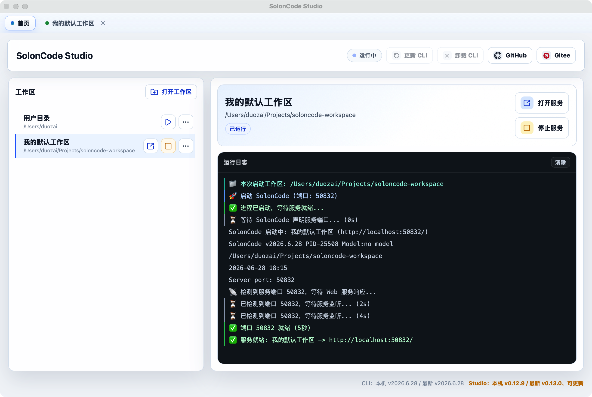
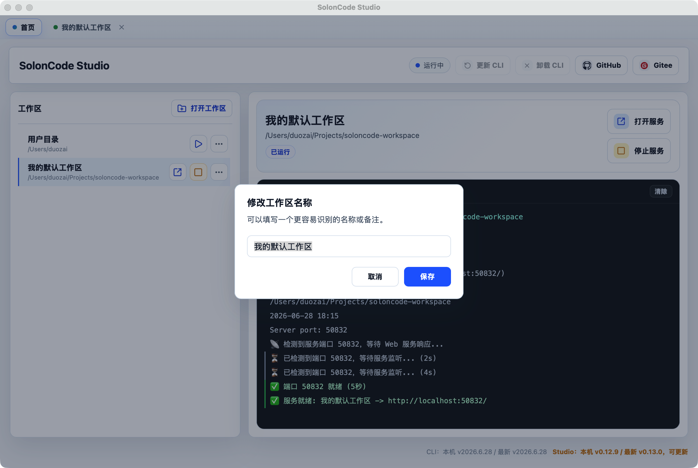
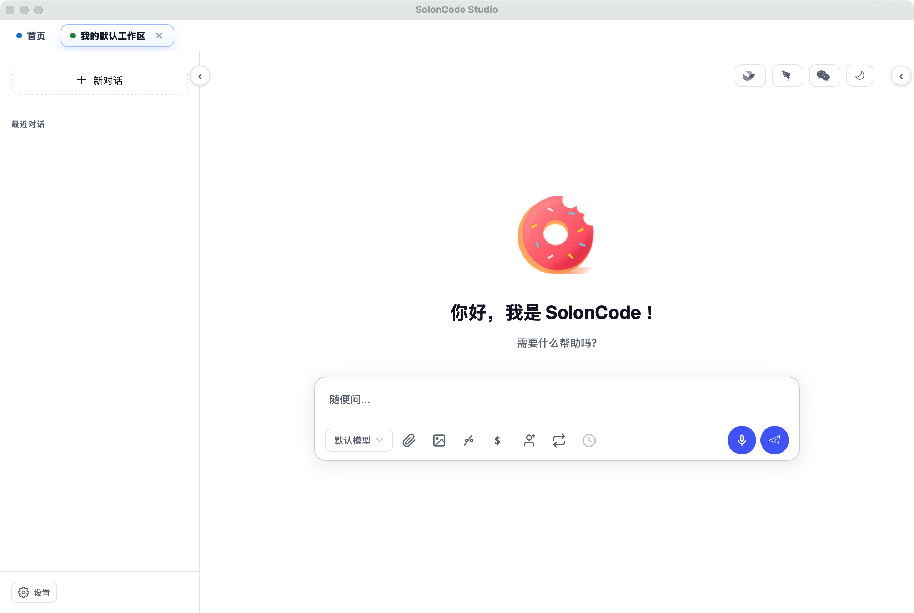

# SolonCode Studio

> ⚠️ **非官方项目** — 本项目是社区开发者开发与维护的第三方桌面工作台，**不是 SolonCode 官方产品**。项目独立开发和发布，如有问题请在本仓库提 Issue。

[SolonCode 官网](https://solon.noear.org/article/soloncode) | [下载最新版本](https://github.com/visduo/soloncode-studio/releases)

SolonCode Studio 是一个基于 Tauri 2 构建的轻量桌面工作台，用于管理 SolonCode CLI 的安装、更新、卸载，以及工作区的启动和 Web 界面访问。

## 功能特性

📦 一键安装、更新和卸载 SolonCode CLI

☕ 自动检测 Java、SolonCode CLI 运行环境

📂 支持自定义工作区目录，同时打开多个工作区

🔄 每个工作区独立的运行状态、端口和日志

🌐 启动后自动在应用内打开 Web 界面

🔔 自动检测 CLI 和 Studio 版本更新

🖥️ 支持 macOS、Windows 和 Linux

## 效果预览

