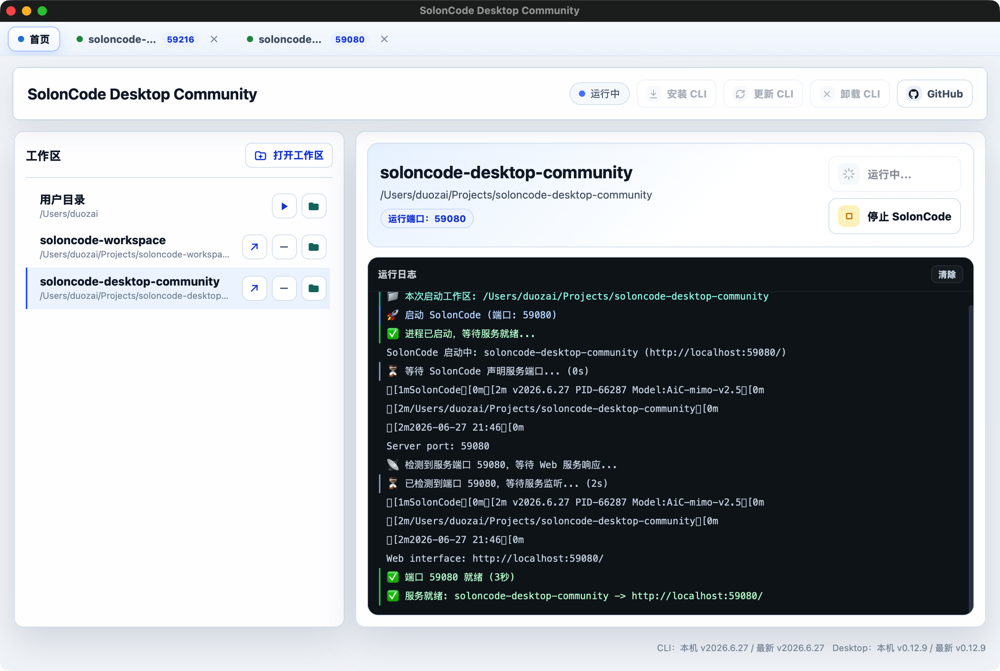
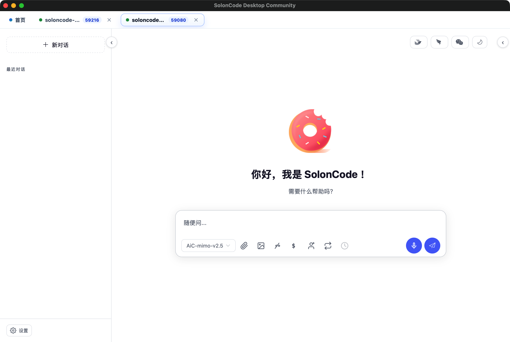

# SolonCode Desktop Community

> ⚠️ **非官方项目** — 本项目是社区开发者开发与维护的第三方桌面启动器，**不是 SolonCode 官方产品**。项目独立开发和发布，如有问题请在本仓库提 Issue。

[SolonCode 官网](https://solon.noear.org/article/soloncode) | [下载最新版本](https://github.com/visduo/soloncode-desktop-community/releases)

SolonCode Desktop Community 是一个基于 Tauri 2 构建的轻量桌面启动器，用于管理 SolonCode CLI 的安装、更新、卸载，以及工作区的启动和 Web 界面访问。

## 效果预览

## 功能特性

- 📦 一键安装、更新和卸载 SolonCode CLI
- ☕ 自动检测 Java、SolonCode CLI 运行环境
- 📂 支持自定义工作区目录，同时打开多个工作区
- 🔄 每个工作区独立的运行状态、端口和日志
- 🌐 启动后自动在应用内打开 Web 界面
- 🔔 自动检测 CLI 和 Desktop 版本更新
- 🖥️ 支持 macOS、Windows 和 Linux
